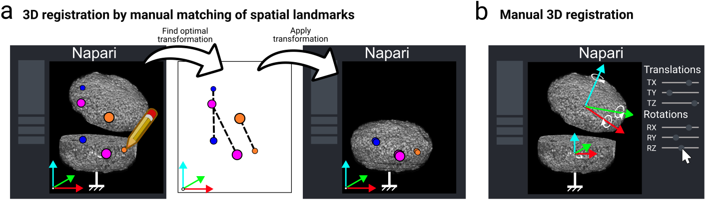
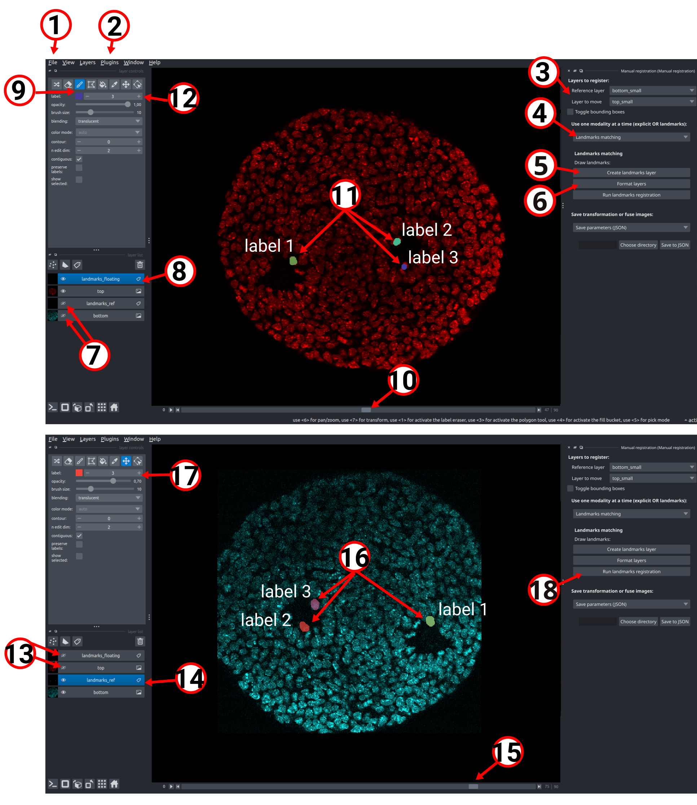
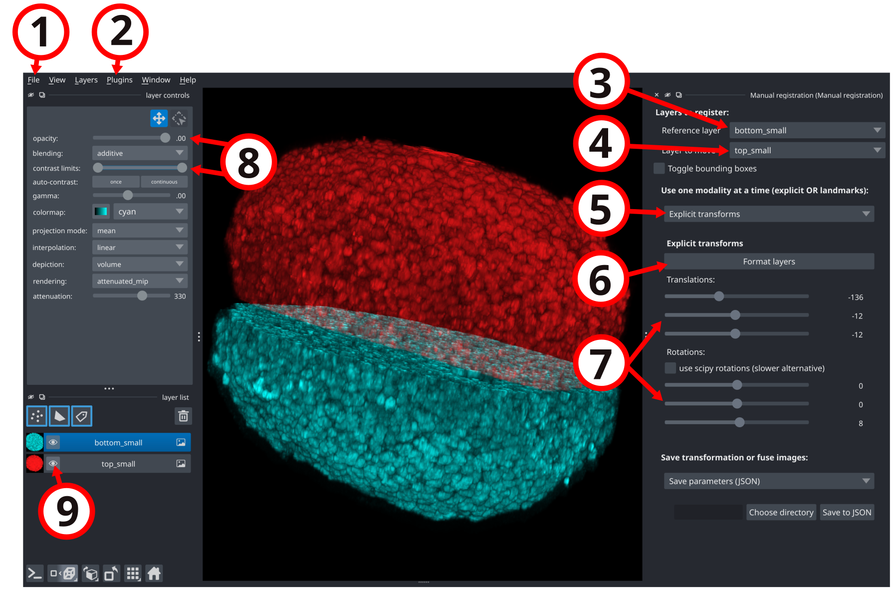
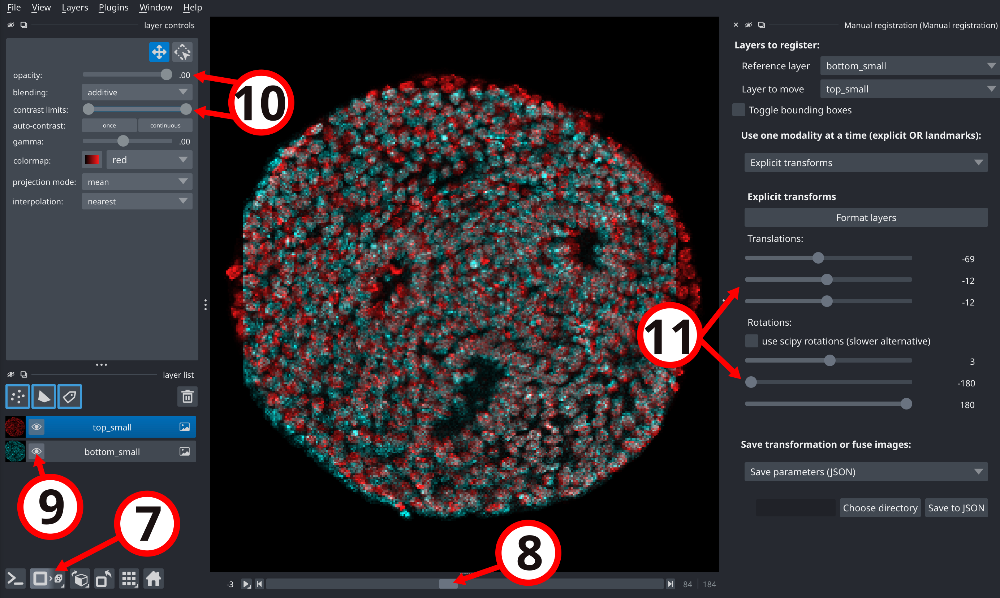
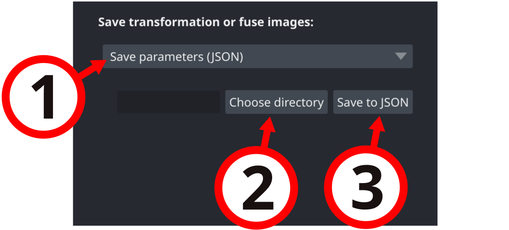
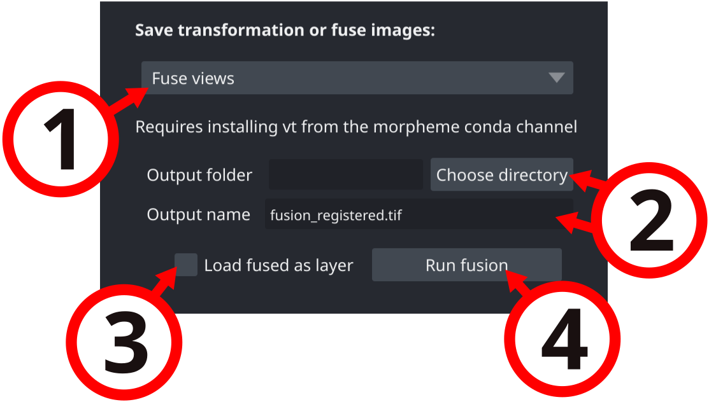

# :herb: napari-manual-registration

A plugin to obtain parameters for affine transform used to register two views of the same object, e.g as obtained with dual-view microscopes. 

`napari-manual-registration` is a [napari] plugin that is part of the [Tapenade](https://github.com/GuignardLab/tapenade) project. Tapenade is a tool for the analysis of dense 3D tissues acquired with deep imaging microscopy. It is designed to be user-friendly and to provide a comprehensive analysis of the data.

If you use this plugin for your research, please [cite us](https://github.com/GuignardLab/tapenade/blob/main/README.md#how-to-cite).

## Overview

A. Registration by annotating salient landmarks|B. Registration by selecting explicit transformation parameters
--|--
|

While working with large and dense 3D and 3D+time gastruloid datasets, we found that being able to visualise and interact with the data dynamically greatly helped processing it.
During the pre-processing stage, dynamical exploration and interaction led to faster tuning of the parameters by allowing direct visual feedback, and gave key biophysical insight during the analysis stage. 

When using our automatic registration tool to spatially register two views of the same organoid, we were sometimes faced with the issue that the tool would not converge to the true registration transformation. This happens when the initial position and orientation of the floating view are too far from their target values. We thus designed a Napari plugin to quickly find a transformation that can be used to initialize our registration tool close to the optimal transformation. From two images loaded in Napari representing two views of the same organoid, the plugin allows the user to 

1. **annotate matching salient landmarks** (e.g bright dead cells or lumen-like structures) in both the reference and floating views, from which an optimal rigid transformation can be found automatically using principal component analysis.

2. **manually define a rigid transformation** by continually varying 3D rotations and translations while observing the results until a satisfying fit is found

## Installation

The plugin obviously requires [napari] to run. If you don't have it yet, follow the instructions [here](https://napari.org/stable/tutorials/fundamentals/installation.html).

Compatible with Python 3.9 to 3.13 (recommended: 3.12).

The simplest way to install `napari-manual-registration` is via the [napari] plugin manager. Open Napari, go to `Plugins > Install/Uninstall Packages...` and search for `napari-manual-registration`. Click on the install button and you are ready to go!

You can also install `napari-manual-registration` via [pip]:

    pip install napari-manual-registration

To get the option to directly fuse the registered views in Napari, you will also need to install the package `vt` from the `morpheme` channel:

    conda install -c conda-forge -c morpheme --strict-channel-priority vt
## Usage

The plugin provides two methods to register two views of the same object. The first method consists in manually drawing landmarks in both views, from which the optimal transformation is found automatically using principal component analysis. The second one consists in selecting manually each transformation parameter (rotation and translation) while observing the result in real-time, either in 2D or 3D (the user can switch between 2D and 3D at any time).

> [!CAUTION]
> Be aware that the visualization does not accomodate for voxel anisotropy, so we recommend using isotropic data, or to resize you anisotropic data to an isotropic voxel size (e.g by using [napari-tapenade-processing](https://github.com/GuignardLab/napari-tapenade-processing)).

Tutorials structure:
- A. Registration by annotating salient landmarks
- B. Registration by selecting explicit transformation parameters
        - Registration with 3D view
        - Registration with 2D view
- C. Export the transformation parameters to a JSON file or fuse the registered views

### A. Registration by annotating salient landmarks

Steps:
1. First, load your images in Napari. You can drag and drop them from your file explorer to the Napari viewer, or open them using the `File > Open files...` menu.
2. Click on the `Plugins > Manual Registration` menu to open the plugin.
3. Select the reference layer from the combo box. The reference layer is chosen to be the one that does not move. Select the floating layer from the combo box. The floating layer is the one that will be transformed.
4. Select "Landmarks matching" from the drop down menu.
5. Click the `Create landmarks layers` button to create two new Labels layers that will be used to annotate the landmarks in the reference and floating views.
6. We recommend pressing the `Format layers for landmarks matching` button so that your layers are automatically formatted for you to begin the registration process. Napari offers a wide range of customisation options for the layers appearances, so feel free to play with them if our formatting does not fit your preferences. ;)
7. We first recommend hiding the reference layer and the reference landmarks layer by clicking on the eye icon next to the layer name in the layer list. This will allow you to focus on the floating layer and the floating landmarks layer.
8. Click on the `landmarks_floating` layer in the layer list to select it. 
9. Click on the `Activate the paint brush` button in the layer properties widget. This will allow you to draw landmarks in the floating view.
10. Navigate through the z-slices of your images using the slider at the bottom of the plugin window.
11. When you have found a salient landmark in the floating view, start drawing a "blob" around it by clicking and dragging your mouse. You can adjust the size of the brush using the `Brush size` slider in the layer properties widget. The shape of the "blob" you draw does not matter, as the plugin currently only uses the center of mass of the "blob" to locate the landmark.
12. Once you have drawn a landmark, click on the `+` button in the layer properties widget to increase the label value. This will allow you to draw another landmark. Change label value after each landmark you draw. Repeat steps 10 to 12 until you have annotated all the salient landmarks in the floating view.
13. Once you have annotated all the salient landmarks in the floating view, hide the floating layers, and show the reference layers and the reference landmarks layer by clicking on the eye icon next to the layer name in the layer list.
14. Click on the `landmarks_reference` layer in the layer list to select it.
15. Navigate to the z-slice of the reference view that corresponds to the z-slice of the floating view where you drew the first landmark.
16. Draw a "blob" around the corresponding landmark in the reference view by clicking and dragging your mouse.
17. Increment your label value by clicking on the `+` button in the layer properties widget each time you draw a new widget. Repeat steps 15 to 17 until you have annotated all the salient landmarks in the reference view.
18. Once you have annotated all the salient landmarks in the reference view, click on the `Run landmark registration` button. The plugin will automatically find the optimal transformation that aligns the floating landmarks to the reference landmarks using principal component analysis.

Go to section C to learn how to save the transformation parameters or fuse the registered views in Napari.

### B. Registration by selecting explicit transformation parameters

#### Registration with 3D view

We describe below the steps to register two views of the same object in a purely 3D manner. Note that the plugin also allows to switch between 2D and 3D at any time, and 2D view is described in the next section. 

Steps:
1. First, load your images in Napari. You can drag and drop them from your file explorer to the Napari viewer, or open them using the `File > Open files...` menu.
2. Click on the `Plugins > Manual Registration` menu to open the plugin.
3. Select the reference layer from the combo box. The reference layer is chosen to be the one that does not move.
4. Select the floating layer from the combo box. The floating layer is the one that will be transformed.
5. Select "Explicit transforms" from the drop down menu.
6. We recommend pressing the `Format layers` button so that your layers are automatically formatted for you to begin the registration process. Napari offers a wide range of customisation options for the layers appearances, so feel free to play with them if our formatting does not fit your preferences. ;)
7. You can now start the registration process by moving the `Translations` and `Rotations` sliders. The floating layer will be transformed in real-time according to the selected parameters. 
8. To optimize the visibility of your images, you can change the contrast limits and opacity of a layer by clicking on the layer name in the layer list and adjusting the sliders in the layer properties widget.
9. If you wish to hide a layer, you can click on the eye icon next to the layer name in the layer list.

Go to section C to learn how to save the transformation parameters or fuse the registered views in Napari.

#### Registration with 2D view

Steps (the steps 1 to 6 are the same as for the 3D registration):

7. If you want to switch to the 2D view, click on the `Toggle 2D/3D view` button (it resembles a square when in 2D mode, or a cube when in 3D mode).
8. In 2D mode, a slider appears at the bottom of the plugin window. You can use it to slide through the z-slices of your images.
9. If you wish to hide a layer, you can click on the eye icon next to the layer name in the layer list.
10. Again, feel free to play with the contrast limits and opacity of the layers to optimize the visibility of your images. First click on the layer name in the layer list, then adjust the sliders in the layer properties widget.
11. You can now start the registration process by moving the `Translations` and `Rotations` sliders. The floating layer will be transformed in real-time according to the selected parameters.

Go to section C to learn how to save the transformation parameters or fuse the registered views in Napari.

### C. Export the transformation parameters to a JSON file or fuse the registered views in Napari

#### Save the transformation parameters to a JSON file

1. Once you are satisfied with the registration, select "Save Parameters (JSON)" from the drop down menu.
2. Choose a directory to save the transformation parameters by clicking on the `Choose directory` button. The transformation parameters will be saved in a `.json` file in this directory.
3. Finally, click on the `Save to JSON` button to save the transformation parameters.

#### Fuse the registered views (optionnally load the fused image in Napari)

1. Once you are satisfied with the registration, select "Fuse views" from the drop down menu.
2. Choose a directory to save the fused image by clicking on the `Choose directory` button. Type the name of the fused image in the `Output name` text box. The fused image will be saved in this directory with the specified name.
3. Optionally, if you want to load the fused image in Napari, check the `Load fused as layer` checkbox.
4. Finally, click on the `Run fusion` button to fuse the registered views and save the fused image. If you checked the `Load fused as layer` checkbox, the fused image will also be loaded in Napari as a new layer.

### D. Load a JSON file with transformation parameters and apply to loaded views

Use this mode to apply a previously saved transformation (from Section C) to the currently selected "Layer to move". This can be useful if you have multichannel images and you want to apply the same registration transform to all channels by saving the transform parameters as a JSON file and applying it to each channel iteratively. The same principle can be used for temporal images, by applying the same registration transform to each time frame sequentially (even though you might want to use automatic registration in a script, e.g via our [registration notebook](https://github.com/GuignardLab/tapenade/blob/main/src/tapenade/notebooks/registration_notebook.ipynb), to automatically iterate through time frames or channels instead of doing it manually in Napari).

1. Load your images in Napari and select the reference and floating layers as usual.
2. In the modality drop down menu, select "Load from JSON".
3. Click on the file field to choose the JSON file containing the saved parameters.
4. Click on the `Apply JSON transform` button to apply the transform to the floating layer.

## Demo dataset

A demo dataset is available [here](https://amubox.univ-amu.fr/s/HLktPNLGgMF4jHT).

### Content

This test dataset is composed of two 3D images `bottom_small.tif` and `top_small.tif` that correspond to two halves of the same sample.

### How to use

 - Load the images from the folder (either drag and drop, or "File>Open file(s)").
 - Specify one of the images as the "Reference layer" (which is fixed), and the other one as the "Layer to move" (usually called "floating").
 - Choose between the "Explicit transforms" or "Landmarks matching" modes, and follow instructions on the plugin repository for further use.   

## How to cite

If you use this plugin for your research, please cite us using the following reference:

- Jules Vanaret, Alice Gros, Valentin Dunsing-Eichenauer, Agathe Rostan, Philippe Roudot, Pierre-François Lenne, Léo Guignard, Sham Tlili (2025) <b>A quantitative pipeline for whole-mount deep imaging and analysis of multi-layered organoids across scales</b>. eLife 14:RP107154 ; doi:https://doi.org/10.7554/eLife.107154.2

## Contributing

Contributions are very welcome. Tests can be run with [tox], please ensure
the coverage at least stays the same before you submit a pull request.

## License

Distributed under the terms of the [BSD-3] license,
"napari-manual-registration" is free and open source software

## Issues

If you encounter any problem using this plugin, please [file an issue] on the GitHub repository.

----------------------------------

This [napari] plugin was generated with [Cookiecutter] using [@napari]'s [cookiecutter-napari-plugin] template.

[napari]: https://github.com/napari/napari
[Cookiecutter]: https://github.com/audreyr/cookiecutter
[@napari]: https://github.com/napari
[MIT]: http://opensource.org/licenses/MIT
[BSD-3]: http://opensource.org/licenses/BSD-3-Clause
[GNU GPL v3.0]: http://www.gnu.org/licenses/gpl-3.0.txt
[GNU LGPL v3.0]: http://www.gnu.org/licenses/lgpl-3.0.txt
[Apache Software License 2.0]: http://www.apache.org/licenses/LICENSE-2.0
[Mozilla Public License 2.0]: https://www.mozilla.org/media/MPL/2.0/index.txt
[cookiecutter-napari-plugin]: https://github.com/napari/cookiecutter-napari-plugin

[file an issue]: https://github.com/jules-vanaret/napari-manual-registration/issues

[napari]: https://github.com/napari/napari
[tox]: https://tox.readthedocs.io/en/latest/
[pip]: https://pypi.org/project/pip/
[PyPI]: https://pypi.org/
